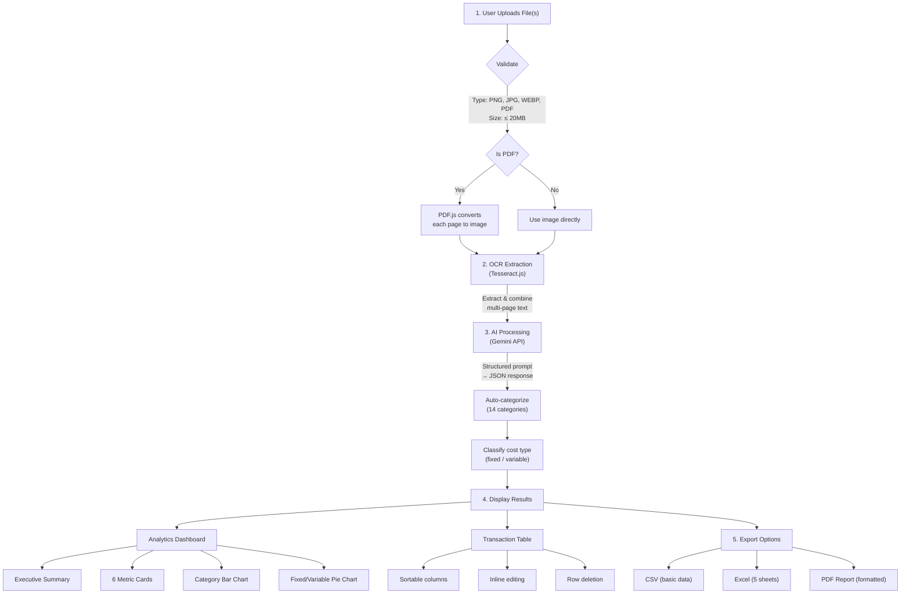

# Project Journey Guide

## Financial Statement Parser - Complete Project Documentation

A comprehensive guide covering the entire development journey, features, architecture, and deployment of the Financial Statement Parser web application.

---

## Table of Contents

1. [Project Overview](#project-overview)
2. [Quick Start](#quick-start)
3. [Complete Feature List](#complete-feature-list)
4. [Tech Stack](#tech-stack)
5. [Architecture](#architecture)
6. [File Structure](#file-structure)
7. [Feature Deep Dive](#feature-deep-dive)
8. [User Journey](#user-journey)
9. [Export Formats](#export-formats)
10. [Deployment](#deployment)
11. [Monetization](#monetization)
12. [Troubleshooting](#troubleshooting)
13. [Development Timeline](#development-timeline)

---

## Project Overview

### What is it?
A privacy-first web application that extracts transaction data from bank statement images and PDFs using AI. Built entirely with client-side technologies, your files never leave your browser.

### Key Value Propositions
- **100% Free** - No subscription, no hidden costs
- **Privacy First** - Files processed locally in your browser
- **AI-Powered** - Smart categorization and data extraction
- **Multiple Exports** - CSV, Excel (5 sheets), PDF reports
- **Visual Analytics** - Charts and insights dashboard

### Who is it for?
- Small business owners tracking expenses
- Freelancers managing finances
- Accountants processing client statements
- Anyone needing to digitize paper statements

---

## Quick Start

### Prerequisites
- Node.js 18 or higher
- A Google account (for free Gemini API key)

### Installation

```bash
# Clone the repository
git clone <your-repo-url>
cd expenses

# Install dependencies
npm install

# Start development server
npm run dev

# Open in browser
# http://localhost:5173
```

### Get Your Free API Key
1. Visit [Google AI Studio](https://aistudio.google.com/apikey)
2. Sign in with your Google account
3. Click "Create API Key"
4. Copy and paste into the app

---

## Complete Feature List

### Core Features (v1.0)
| Feature | Description | Status |
|---------|-------------|--------|
| API Key Management | BYOK model with localStorage storage | Done |
| Image Upload | Drag & drop PNG, JPG, WEBP | Done |
| OCR Processing | In-browser text extraction | Done |
| AI Extraction | Gemini-powered transaction parsing | Done |
| Editable Table | Inline editing with sorting | Done |
| CSV Export | Basic data export | Done |
| Excel Export | .xlsx file generation | Done |
| Responsive Design | Mobile-friendly UI | Done |

### PDF Support (v1.1)
| Feature | Description | Status |
|---------|-------------|--------|
| PDF Upload | Accept PDF bank statements | Done |
| Multi-page Processing | Handle PDFs with many pages | Done |
| PDF to Image | Client-side conversion with pdf.js | Done |

### Analytics & Categories (v1.2)
| Feature | Description | Status |
|---------|-------------|--------|
| Auto-Categorization | AI classifies into 14 categories | Done |
| Cost Type | Fixed vs Variable classification | Done |
| PDF Report Export | Formatted summary report | Done |
| Analytics Utilities | Stats calculation functions | Done |

### Visual Dashboard (v1.3)
| Feature | Description | Status |
|---------|-------------|--------|
| Multiple File Upload | Process several files at once | Done |
| Add More Files | Append to existing results | Done |
| Category Bar Chart | Visual spending breakdown | Done |
| Fixed/Variable Pie | Cost type visualization | Done |
| Executive Summary | AI-generated insights banner | Done |
| 6 Metric Cards | Key financial indicators | Done |
| Enhanced Excel | 5-sheet workbook | Done |
| Improved PDF | Webapp-matching layout | Done |

### Bug Fixes (v1.3.1)
| Feature | Description | Status |
|---------|-------------|--------|
| Add More Merge Fix | Fixed issue where 2nd file replaced 1st file's data | Done |

---

## Tech Stack

### Frontend Framework
| Technology | Version | Purpose |
|------------|---------|---------|
| React | 18.2.0 | UI framework |
| Vite | 5.0.10 | Build tool & dev server |
| Tailwind CSS | 3.4.0 | Utility-first styling |

### Processing Libraries
| Technology | Version | Purpose |
|------------|---------|---------|
| Tesseract.js | 5.0.4 | In-browser OCR (WASM) |
| pdfjs-dist | 4.0.379 | PDF rendering & conversion |
| Recharts | 2.12.0 | Interactive charts |

### Export Libraries
| Technology | Version | Purpose |
|------------|---------|---------|
| xlsx | 0.18.5 | Excel file generation |
| jsPDF | 2.5.1 | PDF report generation |
| jspdf-autotable | 3.8.1 | PDF tables |
| file-saver | 2.0.5 | Client-side downloads |
| html2canvas | 1.4.1 | Chart capture for PDF |

### UI Components
| Technology | Version | Purpose |
|------------|---------|---------|
| Lucide React | 0.303.0 | Icon library |

### AI Integration
| Service | Model | Purpose |
|---------|-------|---------|
| Google Gemini | gemini-2.5-flash | Transaction extraction & categorization |

---

## Architecture

### System Overview


### Data Flow



---

## File Structure

```
expenses/
├── public/
│   └── favicon.svg
│
├── src/
│   ├── components/
│   │   ├── charts/                    # Chart components
│   │   │   ├── AnalyticsDashboard.jsx # Main dashboard
│   │   │   ├── CategoryChart.jsx      # Bar chart
│   │   │   ├── CostBreakdownChart.jsx # Pie chart
│   │   │   └── index.js
│   │   │
│   │   ├── ApiKeyInput.jsx            # Initial API key screen
│   │   ├── FileUpload.jsx             # Drag & drop upload
│   │   ├── ProcessingStatus.jsx       # Progress indicator
│   │   ├── TransactionTable.jsx       # Editable data table
│   │   ├── Summary.jsx                # Legacy summary cards
│   │   ├── ExportButtons.jsx          # CSV/Excel/PDF buttons
│   │   ├── Header.jsx                 # App header
│   │   ├── SettingsModal.jsx          # API key management
│   │   └── index.js
│   │
│   ├── utils/
│   │   ├── storage.js                 # localStorage helpers
│   │   ├── gemini.js                  # Gemini API integration
│   │   ├── ocr.js                     # Tesseract.js wrapper
│   │   ├── pdf.js                     # PDF to image conversion
│   │   ├── export.js                  # CSV/Excel generation
│   │   ├── analytics.js               # Statistics & calculations
│   │   ├── pdfExport.js               # PDF report generation
│   │   └── index.js
│   │
│   ├── App.jsx                        # Main app component
│   ├── main.jsx                       # Entry point
│   └── index.css                      # Tailwind imports
│
├── index.html
├── package.json
├── vite.config.js
├── tailwind.config.js
├── postcss.config.js
├── README.md
├── CHANGELOG.md
└── PROJECT_JOURNEY_GUIDE.md           # This file
```

---

## Feature Deep Dive

### 1. Multiple File Upload

Users can upload multiple bank statement files and combine results.

```javascript
// App.jsx - Processing additional files (v1.3.1 fixed version)
const processAdditionalFiles = async (files) => {
  // Capture current transactions BEFORE processing
  const currentTransactions = [...transactions]

  let newTransactions = []
  for (const file of files) {
    // Pass false to NOT update global status (keeps results visible)
    const result = await processFileInternal(file, false)
    newTransactions = [...newTransactions, ...result.transactions]
  }

  // Merge existing + new transactions
  setTransactions([...currentTransactions, ...newTransactions])
}
```

**Key Implementation Details:**
- `processFileInternal(file, updateStatus)` - Second parameter controls whether to change global `status`
- When `updateStatus = false`, the results section stays visible during processing
- Transactions are captured at start to prevent state loss during async operations
- Each file's transactions get unique IDs to prevent conflicts

**UI Flow:**
1. User uploads first file → Results displayed
2. Click "Add More" button → Select additional files
3. Blue banner shows "Processing additional files..."
4. New transactions appended → Combined analytics

### 2. Category Classification

AI automatically classifies each transaction into 14 categories:

| Category | Examples |
|----------|----------|
| Food & Dining | Restaurants, groceries, food delivery |
| Shopping | Amazon, retail stores |
| Transport | Uber, fuel, parking |
| Utilities | Electricity, water, internet |
| Entertainment | Netflix, movies, games |
| Healthcare | Pharmacy, doctor visits |
| Education | Courses, books, tuition |
| Subscriptions | Monthly services |
| Rent & Housing | Rent, maintenance |
| Insurance | Life, health, vehicle |
| Transfers | Bank transfers |
| Income | Salary, refunds |
| ATM | Cash withdrawals |
| Other | Uncategorized |

### 3. Fixed vs Variable Costs


### 4. Analytics Dashboard

The dashboard displays:


### 5. Export Formats

#### CSV Export
Simple comma-separated values with all fields:
- Date, Description, Category, Cost Type, Debit, Credit, Balance, Reference

#### Excel Export (5 Sheets)
| Sheet | Contents |
|-------|----------|
| Summary | Key metrics, executive summary |
| Categories | Spending breakdown by category |
| Transactions | Full transaction list with totals |
| Fixed Costs | Only fixed expense items |
| Variable Costs | Only variable expense items |

#### PDF Report
Professional formatted report with:
- Header with bank name and period
- Executive summary box
- Key metrics in 2-column layout
- Category breakdown table
- Captured charts (if visible)
- Transaction table with totals
- Page numbers

---

## User Journey

### First-Time User


### Processing Flow


### Adding More Files


---

## Export Formats

### CSV Output Example
```csv
Date,Description,Category,Cost Type,Debit,Credit,Balance,Reference
2024-01-15,AMAZON PAY,Shopping,variable,2499,,45000,TXN123
2024-01-16,SALARY,Income,fixed,,100000,145000,SAL001
```

### Excel Sheets Preview

**Sheet 1: Summary**
```
FINANCIAL SUMMARY REPORT
Generated: 06-Feb-2024

KEY METRICS
Total Income        ₹100,000
Total Expenses      ₹55,000
Net Cash Flow       ₹45,000
Daily Burn Rate     ₹1,833

EXECUTIVE SUMMARY
Cash Flow Positive by ₹45,000
Top spending category: Food & Dining (₹15,000)
```

**Sheet 2: Categories**
```
Category          Amount    % of Total
Food & Dining     ₹15,000   27.3%
Shopping          ₹12,000   21.8%
Transport         ₹8,000    14.5%
...
```

### PDF Report Structure


---

## Deployment

### Option 1: Vercel (Recommended)

```bash
# Install Vercel CLI
npm install -g vercel

# Deploy
vercel

# Follow prompts
# ✓ Set up and deploy? Yes
# ✓ Which scope? Your account
# ✓ Link to existing project? No
# ✓ Project name? financial-parser
# ✓ Directory? ./

# Done! Your app is live at https://your-app.vercel.app
```

### Option 2: Netlify

```bash
# Build the project
npm run build

# Option A: Drag & drop
# Go to netlify.com/drop
# Drag the 'dist' folder

# Option B: CLI
npm install -g netlify-cli
netlify deploy --prod --dir=dist
```

### Option 3: GitHub Pages

```bash
# Add to package.json scripts:
"deploy": "npm run build && npx gh-pages -d dist"

# Run
npm run deploy
```

### Option 4: Docker

```dockerfile
FROM node:18-alpine AS build
WORKDIR /app
COPY package*.json ./
RUN npm ci
COPY . .
RUN npm run build

FROM nginx:alpine
COPY --from=build /app/dist /usr/share/nginx/html
EXPOSE 80
CMD ["nginx", "-g", "daemon off;"]
```

```bash
docker build -t financial-parser .
docker run -p 8080:80 financial-parser
```

**All options are FREE for static sites.**

---

## Monetization

### Strategy 1: Freemium


### Strategy 2: One-Time Purchase


### Cost Structure

| Item | MVP Cost | Scaled Cost |
|------|----------|-------------|
| Hosting (Vercel/Netlify) | $0 | $0-20/mo |
| Domain | $12/year | $12/year |
| Gemini API | $0 (user's key) | Usage-based |
| **Total** | **~$1/month** | **$20-100/month** |

---

## Troubleshooting

### Common Issues

| Issue | Cause | Solution |
|-------|-------|----------|
| PDF worker fails | CDN loading issue | Hard refresh (Ctrl+Shift+R) |
| API key invalid | Wrong key format | Key should start with 'AIza' |
| Response truncated | Token limit | Uses salvage logic automatically |
| OCR poor quality | Low resolution image | Use clearer, higher resolution images |
| Charts not in PDF | DOM not ready | Charts captured from visible DOM |
| Add More replaces data | v1.3.0 bug | Fixed in v1.3.1 - update your code |

### Debug Commands

```javascript
// Check PDF.js version
console.log('pdf.js version:', pdfjsLib.version)

// Check API response
console.log('Gemini response:', response)

// Check transaction data
console.log('Transactions:', transactions)
```

### Browser Console Errors

| Error | Meaning |
|-------|---------|
| `CORS error` | Shouldn't happen - Gemini allows browser requests |
| `404 pdf.worker` | PDF.js worker URL mismatch |
| `JSON parse error` | Gemini response malformed |

---

## Development Timeline

### Phase 1: Core MVP
- [x] API key input & validation
- [x] Image upload (drag & drop)
- [x] OCR with Tesseract.js
- [x] AI extraction with Gemini
- [x] Editable results table
- [x] CSV/Excel export
- [x] Responsive design

### Phase 2: PDF Support
- [x] PDF file upload
- [x] Multi-page processing
- [x] PDF.js integration

### Phase 3: Categories & Analytics
- [x] Auto-categorization (14 categories)
- [x] Fixed vs Variable classification
- [x] Analytics utilities
- [x] PDF report export

### Phase 4: Visual Dashboard
- [x] Multiple file upload
- [x] Add More files feature
- [x] Category bar chart
- [x] Fixed/Variable pie chart
- [x] Executive summary banner
- [x] 6 metric cards
- [x] Enhanced Excel (5 sheets)
- [x] Improved PDF layout

### Phase 4.1: Bug Fixes
- [x] Fixed "Add More" replacing data instead of merging
  - Added `updateStatus` parameter to `processFileInternal()`
  - Capture transactions before async processing
  - Keep status as 'complete' during additional file processing

### Future Roadmap
- [ ] Dark mode
- [ ] Transaction search/filter
- [ ] Custom categories
- [ ] Data persistence (IndexedDB)
- [ ] PWA support
- [ ] Multiple currency support

---

## Resources

### Documentation
- [Vite](https://vitejs.dev/)
- [React](https://react.dev/)
- [Tailwind CSS](https://tailwindcss.com/docs)
- [Recharts](https://recharts.org/)

### Libraries
- [Tesseract.js](https://tesseract.projectnaptha.com/)
- [pdf.js](https://mozilla.github.io/pdf.js/)
- [jsPDF](https://github.com/parallax/jsPDF)
- [SheetJS](https://sheetjs.com/)

### APIs
- [Google Gemini](https://ai.google.dev/docs)

### Deployment
- [Vercel](https://vercel.com/docs)
- [Netlify](https://docs.netlify.com/)

---

## Support

For questions or issues:
- Open an issue on GitHub
- Check the [CHANGELOG.md](./CHANGELOG.md) for recent changes

---

*Last updated: February 2025*
